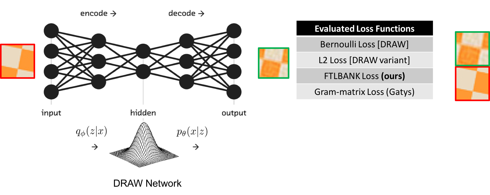

# draw

TensorFlow implementation of [DRAW: A Recurrent Neural Network For Image Generation](http://arxiv.org/pdf/1502.04623.pdf) on the Texture synthesis task.

Texture synthesis is the process of generating a new texture given a texture sample. Mapping a texture onto surface, scene rendering, occlusion fill-in, lossy image, video compression, and foreground removal are applications for texture synthesis. In this project, DRAW network, initially proposed to generate MNIST dataset, is amended to generate textures. Generated tiles are constrained to both having the same texture and aligning smoothly with neighboring tiles. Our texture synthesis model can expand a sample texture and generate a new sample with user-defined dimensions. The following figure shows our pipeline.

We train DRAW to synthesize a texture and enforce smooth alignment between neighboring tiles. We propose a novel loss function, FLTBNKs, for training a generative texture network. It is evaluated against L2 loss, as a baseline, and the texture loss proposed by Gatys et al.. 
As we sample texture tiles from DTD, DRAW, a recurrent variational auto-encoder, learns neighboring tiles. Multiple loss functions are evaluated for texture synthesis. In the deployment phase, the trained network generates the four neighboring tiles for a center tile --- an initial sample texture. The generated tiles act as input in the next step to further expand the texture size.
